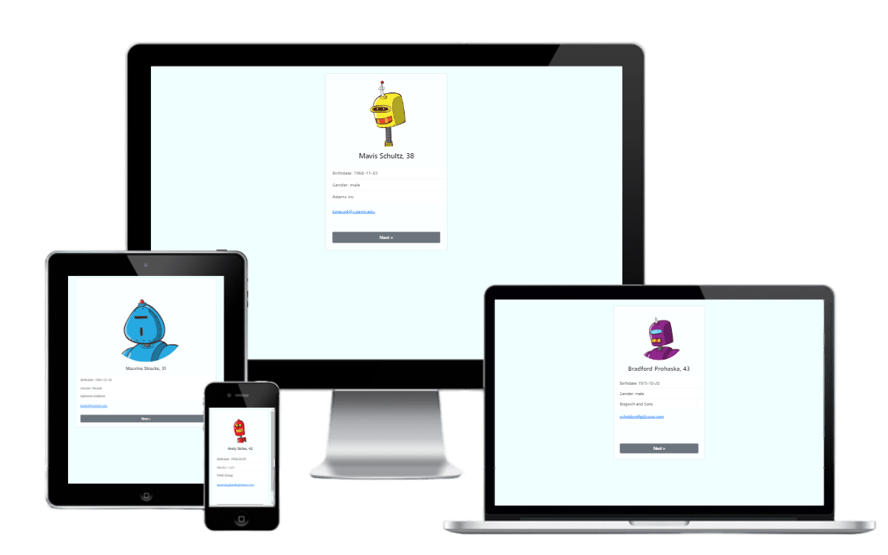

<h1> Случайный пользователь </h1>
<a href="https://js-random-user-app.netlify.app/"> https://js-random-user-app.netlify.app/ </a>

  

 

<h2>О проекте</h2>

 Упражнение в рамках изучения API JS 

 

<h2>Используемые технологии</h2>

 HTML5 | CSS3 | Bootstrap | JavaScript | API 

 

<h2>Особенности</h2>
<ul>
  <li> кликните на кнопку Next для получения следующего пользователя </li>
  <li> работа с XMLHttpRequest </li>
  <li> сайт адаптирован под мобильные устройства </li>
</ul>
